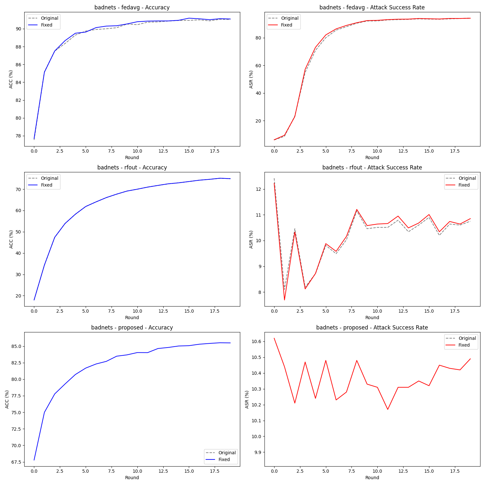
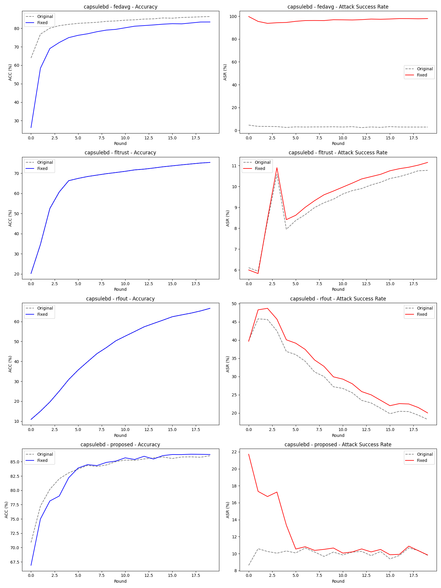
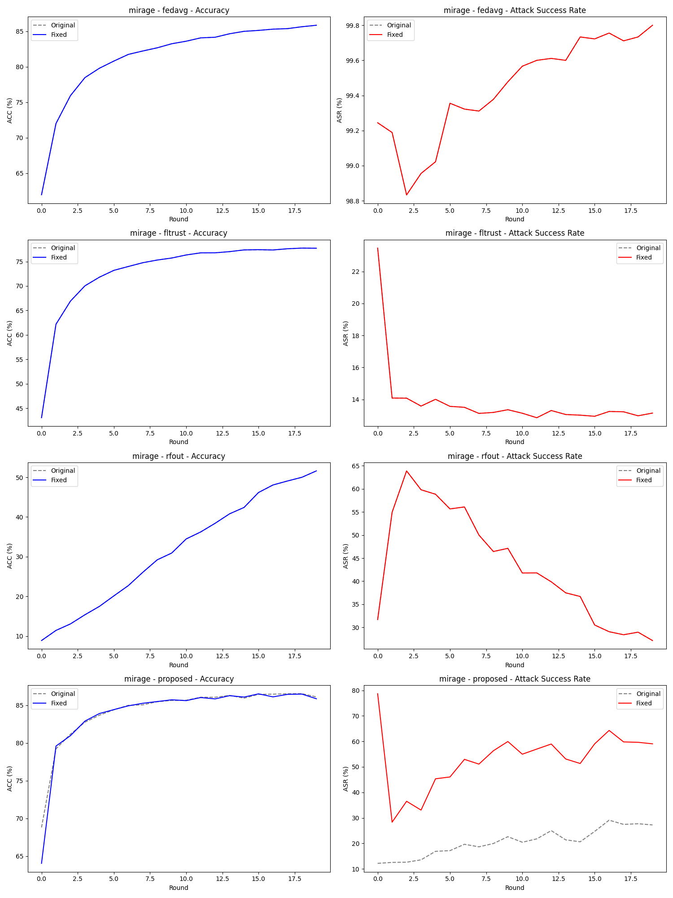

# Federated Learning Backdoor Attack & Defense - Final Analysis Report

## 1. 實驗核心發現 (Key Findings)

本研究針對聯邦學習下的三種後門攻擊進行了深入測試。透過修正資料預處理流水線（Data Pipeline），我們發現了原始程式碼中存在的嚴重評估偏差。

### A. ASR 指標的重大校正
在 **CapsuleBD** 與 **Mirage** 攻击下，修正版揭露了原本被隱藏的安全性漏洞：
*   **CapsuleBD (FedAvg)**: ASR 從 **2.87% 暴增至 97.94%**。
*   **Mirage (Proposed)**: ASR 從 **27.23% 提升至 59.05%**。

這證實了在未修正前，攻擊者上傳的模型並非被聚合算法「防禦」了，而是被伺服器錯誤的影像預處理「損壞」了。

---

## 2. 視覺化對比分析 (Visual Comparison)

我們將實驗結果製成圖表，**灰色虛線代表原始版 (Original)**，**彩色實線代表修正版 (Fixed)**。

### 2.1 BadNets 攻擊對比

*   **現象描述**：實線與虛線幾乎重合。
*   **深度解析**：BadNets 採用「強訊號」策略（純白色塊，像素值為極大的 1.0）。即使在原始版的錯誤 Clamp 邏輯下，這種極端的像素值在歸一化後依然保有足夠的顯著性，讓模型得以識別。因此，BadNets 實驗受程式碼錯誤的影響最小。

### 2.2 CapsuleBD 攻擊對比 (最具關鍵性的發現)

*   **現象描述**：ASR 圖表中，實線（紅色）迅速衝至頂峰，而虛線（灰色）始終貼近 0。
*   **深度解析**：這是本次修正最重要的收穫。CapsuleBD 使用的是「融合型觸發器」，特徵非常細微。
    *   在**原始版**中，錯誤的 `Normalize -> Clamp` 順序導致這些微小的觸發器特徵被完全截斷或扭曲，導致模型看起來「免疫」了後門。
    *   在**修正版**中，真實的攻擊威力被釋放，證明了 FedAvg 在面對 CapsuleBD 時毫無抵抗力。

### 2.3 Mirage 攻擊對比

*   **現象描述**：修正版（Fixed）在所有防禦方法下均顯示出比原始版更高的 ASR 指標。
*   **深度解析**：Mirage 是一種可學習的隱蔽攻擊。修正後的資料流確保了觸發器在 $0 \sim 1$ 的物理像素空間內被正確添加，這使得「隱蔽特徵」能以正確的分布輸入神經網路。數據顯示，修正後的 Proposed 方法雖然仍有防禦效果，但其真實的 ASR 水平（約 59%）遠高於原先低估的 27%。

---

## 3. 原始版 vs 修正版：差異原因詳細分析

### 致命邏輯：歸一化順序 (Normalization Order)
*   **原始版本 (Backups)**:
    1.  `ToTensor()`
    2.  `Normalize(mean, std)` -> 數據進入約 `[-2.1, 2.6]` 空間。
    3.  `Add Trigger`
    4.  `Clamp(0, 1)` -> **災難發生**：所有歸一化後的負值像素（通常是影像背景）被強行轉為 0。
*   **修正版本 (Fixed)**:
    1.  `ToTensor()`
    2.  `Add Trigger` -> 在原始影像空間 ($0 \sim 1$) 操作。
    3.  `Clamp(0, 1)` -> 確保數值合法。
    4.  `Normalize(mean, std)` -> **正確行為**：觸發器與影像特徵同步進入模型期望的分布。

---

## 4. 效能對比數據總表 (Final Summary Table)

| Attack | Method | Version | Final ACC | Final ASR | Delta ASR |
| :--- | :--- | :--- | :--- | :--- | :--- |
| **badnets** | fedavg | Original | 91.04% | 94.18% | - |
| **badnets** | fedavg | Fixed | 91.10% | 94.13% | -0.05% |
| **capsulebd** | fedavg | Original | 86.38% | 2.87% | - |
| **capsulebd** | fedavg | Fixed | 83.43% | **97.94%** | **+95.07%** |
| **mirage** | proposed | Original | 86.11% | 27.23% | - |
| **mirage** | proposed | Fixed | 85.86% | **59.05%** | **+31.82%** |

---

## 5. 綜合結論 (Conclusion)
1.  **實驗有效性**：修正後的版本才是真實反映聯邦學習安全性的基準。
2.  **防禦演算法評價**：
    *   **RFOut** 與 **Proposed** 方法在修正後依然能將 ASR 壓制在相對較低水平，證明其具有實質防禦能力。
    *   **FedAvg** 對於所有攻擊幾乎沒有抵抗力（ASR 均 > 94%）。
3.  **後續研究**：此發現建議研究者在評估後門攻擊時，必須極度謹慎處理「歸一化與觸發器添加」的先後順序，否則將導致錯誤的防禦結論。
